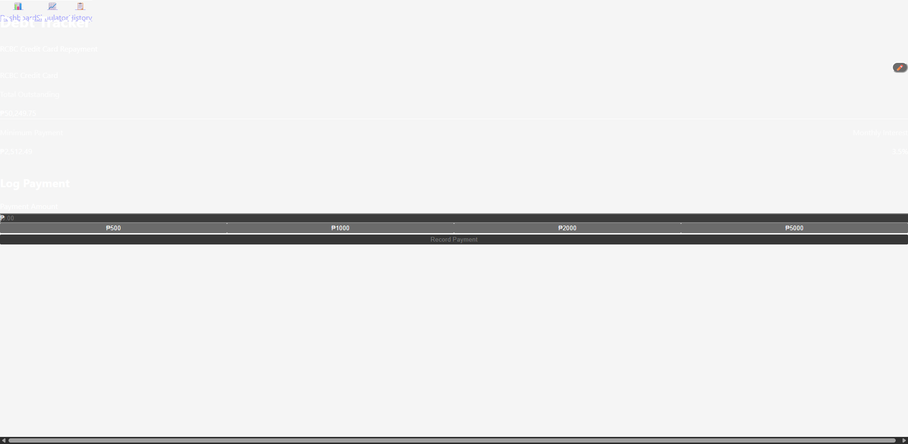

# 💳 RCBC Debt Tracker

A **mobile-first Progressive Web App (PWA)** for tracking and managing RCBC credit card debt repayment. Built with React, Vite, Firebase, and Tailwind CSS.



## ✨ Features

### 📊 Debt Dashboard
- **Real-time Debt Tracking**: Display current debt balance with large, readable typography
- **Minimum Payment Calculator**: Automatic calculation of required minimum payments (5% of balance or ₱500)
- **Payment Logging**: Easy-to-use numeric pad optimized input for recording payments
- **Interest vs Principal Split**: See exactly how much of your payment goes to interest vs principal reduction
- **Recent Activity Feed**: Track your payment history with detailed breakdowns

### 📈 Payment Simulator
- **Repayment Timeline**: Calculate how long it will take to pay off your debt
- **Total Interest Projection**: See the total interest you'll pay over the life of the debt
- **Month-by-Month Schedule**: Detailed payment schedule showing balance reduction over time
- **Quick Amount Presets**: Test different payment scenarios with one tap

### 📋 Payment History
- Full transaction history (Coming Soon)
- Charts and analytics (Coming Soon)

### ✏️ Manual Adjustments
- Bottom-sheet drawer for easy debt principal adjustments
- Add notes for corrections or lump-sum payments

## 🧮 RCBC Credit Card Interest Calculation

This app uses the **RCBC-specific finance charge formula**:
- **Monthly Interest Rate**: 3.5% (42% APR) - typical for Philippine credit cards
- **Minimum Payment**: 5% of outstanding balance or ₱500, whichever is higher
- **Interest Method**: Average Daily Balance (simplified monthly calculation for tracking)

### Formula
```
Monthly Interest = Principal × 3.5%
Principal Payment = Total Payment - Interest
New Balance = Principal - Principal Payment
```

## 🚀 Technology Stack

- **Frontend**: React 18 + TypeScript
- **Build Tool**: Vite 7.2.4 (Fast, modern bundler)
- **Styling**: Tailwind CSS v4 + Custom Design System
- **Routing**: React Router DOM
- **Backend**: Firebase (Authentication + Firestore)
- **Deployment**: Vercel
- **PWA**: Progressive Web App with offline support

## 📱 Mobile-First Design

- **Touch-Optimized**: Large touch targets, swipe gestures
- **Bottom Navigation**: Thumb-friendly navigation bar
- **Numeric Input**: `inputMode="decimal"` for native number keyboards
- **Safe Areas**: Respects device notches and rounded corners
- **Responsive**: Works perfectly on all screen sizes

## 🔧 Setup & Installation

### Prerequisites
- Node.js 18+ 
- npm or yarn
- Firebase account
- Vercel CLI (for deployment)

### Local Development

1. **Clone the repository**
```bash
git clone https://github.com/Deign86/rcbc-debt-tracker.git
cd rcbc-debt-tracker
```

2. **Install dependencies**
```bash
npm install
```

3. **Configure Firebase**
- Create a Firebase project at [console.firebase.google.com](https://console.firebase.google.com)
- Enable Authentication and Firestore
- Copy your Firebase config to `src/config/firebase.ts`

4. **Start development server**
```bash
npm run dev
```

Visit `http://localhost:5173` in your browser.

### Build for Production
```bash
npm run build
```

### Deploy to Vercel
```bash
vercel --prod
```

## 📂 Project Structure

```
rcbc-debt-tracker/
├── src/
│   ├── components/          # React components
│   │   ├── Layout.tsx       # Main layout with bottom nav
│   │   ├── DebtCard.tsx     # Debt display card
│   │   ├── PaymentForm.tsx  # Payment input form
│   │   └── EditDebtSheet.tsx # Bottom sheet for editing
│   ├── pages/               # Route pages
│   │   ├── Dashboard.tsx    # Main dashboard
│   │   ├── Simulator.tsx    # Payment simulator
│   │   └── History.tsx      # Payment history
│   ├── hooks/               # Custom React hooks
│   │   └── useDebtCalculator.ts # RCBC calculation logic
│   ├── types/               # TypeScript types
│   │   └── debt.ts          # Debt-related types
│   ├── config/              # Configuration files
│   │   └── firebase.ts      # Firebase config
│   └── App.tsx              # Main app component
├── public/
│   └── manifest.json        # PWA manifest
└── package.json
```

## 🔐 Security & Privacy

- No sensitive data stored without user consent
- Firebase Authentication for secure user sessions
- All financial calculations done client-side
- HTTPS-only in production

## 📊 Roadmap

- [ ] Firebase Authentication integration
- [ ] Cloud Firestore for payment history sync
- [ ] Charts and visualizations
- [ ] Export payment history (PDF, CSV)
- [ ] Multiple credit card support
- [ ] Dark mode
- [ ] Offline support with service worker
- [ ] Push notifications for payment reminders

## 🤝 Contributing

Contributions are welcome! Please feel free to submit a Pull Request.

## 📄 License

MIT License - feel free to use this project for personal or commercial purposes.

## 🙏 Acknowledgments

- Built for managing RCBC credit card debt in the Philippines
- Inspired by the need for transparent debt tracking
- RCBC interest calculation based on typical Philippine credit card terms

## 📧 Contact

- GitHub: [@Deign86](https://github.com/Deign86)
- Project Link: [https://github.com/Deign86/rcbc-debt-tracker](https://github.com/Deign86/rcbc-debt-tracker)
- Live Demo: [https://rcbc-debt-tracker-hephfu9wj-deign86s-projects.vercel.app](https://rcbc-debt-tracker-hephfu9wj-deign86s-projects.vercel.app)

---

**Note**: This is an independent project and is not officially affiliated with RCBC (Rizal Commercial Banking Corporation).
